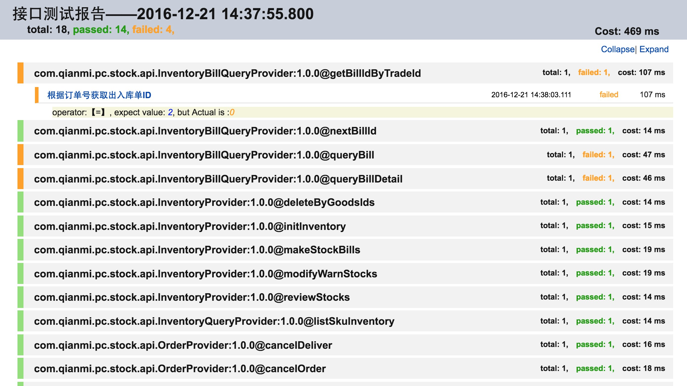

接口测试工具
==============
目标：降低接口测试难度、帮助开发人员快速测试接口。
目前已支持dubbo接口测试（需要借助[Edge](https://github.com/qianmiopen/edge)将dubbo接口以http形式发布），后期可以经过简单修改就能支持rest接口测试。
测试人员通过json、js语言编写用例文件，通过maven插件执行用例，并生成报告；


与Edge比较
Edge擅长的是以可视化的方式、实时的对接口进行测试，测试结果返回后需要人为的check。比较适合在开发、联调阶段使用。
interface-test将用例以脚本的方式保存下来，通过脚本自定义check规则，程序自动判断接口测试结果，用例可以回放执行。比较适合用在服务重构后接口的兼容检查、版本上线前的接口检测。
测试dubbo接口时，interface-test工具依赖Edge工具的测试接口。

## 使用介绍

添加依赖
```xml
<dependencies>
    <dependency>
        <groupId>com.qianmi</groupId>
        <artifactId>interface-test</artifactId>
        <version>${version}</version>
        <scope>runtime</scope>
    </dependency>
</dependencies>
```
指定build plugin
```xml
<plugin>
    <groupId>org.codehaus.mojo</groupId>
    <artifactId>exec-maven-plugin</artifactId>
    <version>1.5.0</version>
    <executions>
        <execution>
            <id>run-testcase</id>
            <goals>
                <goal>java</goal>
            </goals>
        </execution>
    </executions>
    <configuration>
        <classpathScope>runtime</classpathScope>
        <mainClass>org.springframework.boot.loader.JarLauncher</mainClass>
        <arguments>
            <argument>-Dspring.config.location=${basedir}/application.properties</argument> <!--指定运行配置文件-->
        </arguments>
    </configuration>
</plugin>
```

application.properties
```properties
logging.level.root=info
logging.level.com.qianmi=debug
logging.level.com.qianmi.tda.report=info

## 测试用例根目录
test-suit-home=${user.dir}/testcase/com/qianmi/pc/stock/api
## 测试用例文件扩展名
test-case-file-extensions=.ts.json, .ts.js
## 测试报告根目录
test-reports-home=${user.dir}/reports
## 默认dubbo测试服务器地址(Edge服务地址)
default-test-server-url=http://172.19.65.96:8080/executeTest.do

http.client.connection-manager-default-max-per-route=1000
http.client.request-connect-timeout=2000
http.client.connection-manager-max-total=1000
http.client.request-read-timeout=100000

```

使用demo: [interface-test-demo](https://github.com/qianmiopen/inderface-demo)

### 创建测试套（TestSuit）
<span id="TestCase">TestCase模板：</span>
```json
   {
      "name": "case1",
      "params": [],
      "expects": [
        {
          "operator": "=",
          "path": "$",
          "value": {}
        }
      ]
    }
```
| Field              |Type      | Description                                                        |
| :------------------|:-------- | :----------------------------------------------------------------- |
| name               |String    | 用例名称，建议根据测试场景命名，不可为空                                  |
| params             |Object[]  | 参数列表，待测接口的JSON格式                                            |
| expects            |Expect[]  | 断言数组。|

> operator: 期待值与真实值的比较操作符，支持“=、!=、<、<=、>、>=、contains、!contains、match、!match”;<br/>
> path: 从接口返回结果取值的路径，参见[JsonPath](#JsonPath);<br/>
> value: 期待值<br/>


<span id="TestSuit">TestSuit模板：</span>
```json
{
  "dubboServiceURL": "dubbo://172.19.65.199:20880",
  "execOrder": 1,
  "intfName": "com.qianmi.pc.api.app.AppProductProvider:1.0.0@addFromOwner",
  "testCases": [{}],
  "testServerURL": null
}
```

| Field              |Type      | Description                                                        |
| :------------------|:-------- | :----------------------------------------------------------------- |
| dubboServiceURL    |String    | dubbo服务地址，可为空，未指定时从dubbo注册中心上自动查找                 |
| execOrder          |Number    | 测试套执行顺序，默认为1，值越小优先级越高                                |
| intfName           |String    | 待测接口名，不填写时将根据文件名猜测                                    |
| testCases          |TestCase[]| 测试用例数组，参见[TestCase](#TestCase)                               |
| testServerURL      |String    | 测试目标服务器地址，测试dubbo接口时，此处配置[Edge](https://github.com/qianmiopen/edge)服务器代理地址           |

> intfName为空时，系统会根绝文件路径与文件名进行猜测。例如：在%TEST_SUIT_HOME%目录下放置"com/qianmi/pc/api/app/AppProductProvider#1.0.0@addFromOwner.ts.json"文件，intfName将会自动猜测为："com.qianmi.pc.api.app.AppProductProvider:1.0.0@addFromOwner"


完整TestSuit示例：
```json
{
  "dubboServiceURL": "dubbo://172.19.65.199:20880",
  "execOrder": 1,
  "intfName": "com.qianmi.pc.api.app.AppProductProvider:1.0.0@addFromOwner",
  "testCases": [
    {
      "name": "成功从供应商添加商品",
      "params": [
        {
          "chainMasterId": "A1295139",
          "commissionType": 1,
          "cost": 0,
          "optUserCode": null,
          "optUserName": null,
          "price": 0,
          "productId": "1300607",
          "shopStatus": 0,
          "stock": 0,
          "supplierId": "A1437887"
        }
      ],
      "expects": [
        {
          "operator": "=",
          "path": "$.sourceChainMasterId",
          "value": "A1295139"
        },{
          "operator": "=",
          "path": "$.productId",
          "value": "1300607"
        },{
          "operator": ">=",
          "path": "$.goodsIds.length()",
          "value": 1
        }
      ]
    }
  ],
  "testServerURL": "http://172.19.65.96:8080/executeTest.do"
}
```
> TestSuit文件存放路径以及命名规则:<br/>
> 默认TEST_SUIT_HOME目录在System.getProperty("user.dir")下的testcase目录。<br/>
> src/test/java/com/qianmi/tda/TestCaseGenerator.java提供了根据ES接口日志自动生成TestSuit的方法。

### 执行测试
>打开com.qianmi.tda.InterfaceTestApplication，执行main方法即可。测试报告存放在TEST_SUIT_HOME下。


### <span id="JsonPath">JsonPath表达式</span>
JsonPath expressions can use the dot–notation

`$.store.book[0].title`

or the bracket–notation

`$['store']['book'][0]['title']`

#### Operators

| Operator                  | Description                                                        |
| :------------------------ | :----------------------------------------------------------------- |
| `$`                       | The root element to query. This starts all path expressions.       |
| `@`                       | The current node being processed by a filter predicate.            |
| `*`                       | Wildcard. Available anywhere a name or numeric are required.       |
| `..`                      | Deep scan. Available anywhere a name is required.                  |
| `.<name>`                 | Dot-notated child                                                  |
| `['<name>' (, '<name>')]` | Bracket-notated child or children                                  |
| `[<number> (, <number>)]` | Array index or indexes                                             |
| `[start:end]`             | Array slice operator                                               |
| `[?(<expression>)]`       | Filter expression. Expression must evaluate to a boolean value.    |


#### Functions

Functions can be invoked at the tail end of a path - the input to a function is the output of the path expression.
The function output is dictated by the function itself.

| Function                  | Description                                                        | Output    |
| :------------------------ | :----------------------------------------------------------------- |-----------|
| min()                    | Provides the min value of an array of numbers                       | Double    |
| max()                    | Provides the max value of an array of numbers                       | Double    |
| avg()                    | Provides the average value of an array of numbers                   | Double    |
| stddev()                 | Provides the standard deviation value of an array of numbers        | Double    |
| length()                 | Provides the length of an array                                     | Integer   |


#### Filter Operators

Filters are logical expressions used to filter arrays. A typical filter would be `[?(@.age > 18)]` where `@` represents the current item being processed. More complex filters can be created with logical operators `&&` and `||`. String literals must be enclosed by single or double quotes (`[?(@.color == 'blue')]` or `[?(@.color == "blue")]`).   

| Operator                 | Description                                                       |
| :----------------------- | :---------------------------------------------------------------- |
| ==                       | left is equal to right (note that 1 is not equal to '1')          |
| !=                       | left is not equal to right                                        |
| <                        | left is less than right                                           |
| <=                       | left is less or equal to right                                    |
| >                        | left is greater than right                                        |
| >=                       | left is greater than or equal to right                            |
| =~                       | left matches regular expression  [?(@.name =~ /foo.*?/i)]         |
| in                       | left exists in right [?(@.size in ['S', 'M'])]                    |
| nin                      | left does not exists in right                                     |
| size                     | size of left (array or string) should match right                 |
| empty                    | left (array or string) should be empty                            |


Path Examples
-------------

Given the json

```json
{
    "store": {
        "book": [
            {
                "category": "reference",
                "author": "Nigel Rees",
                "title": "Sayings of the Century",
                "price": 8.95
            },
            {
                "category": "fiction",
                "author": "Evelyn Waugh",
                "title": "Sword of Honour",
                "price": 12.99
            },
            {
                "category": "fiction",
                "author": "Herman Melville",
                "title": "Moby Dick",
                "isbn": "0-553-21311-3",
                "price": 8.99
            },
            {
                "category": "fiction",
                "author": "J. R. R. Tolkien",
                "title": "The Lord of the Rings",
                "isbn": "0-395-19395-8",
                "price": 22.99
            }
        ],
        "bicycle": {
            "color": "red",
            "price": 19.95
        }
    },
    "expensive": 10
}
```

| JsonPath (click link to try)| Result |
| :------- | :----- |
| <a href="http://jsonpath.herokuapp.com/?path=$.store.book[*].author" target="_blank">$.store.book[*].author</a>| The authors of all books     |
| <a href="http://jsonpath.herokuapp.com/?path=$..author" target="_blank">$..author</a>                   | All authors                         |
| <a href="http://jsonpath.herokuapp.com/?path=$.store.*" target="_blank">$.store.*</a>                  | All things, both books and bicycles  |
| <a href="http://jsonpath.herokuapp.com/?path=$.store..price" target="_blank">$.store..price</a>             | The price of everything         |
| <a href="http://jsonpath.herokuapp.com/?path=$..book[2]" target="_blank">$..book[2]</a>                 | The third book                      |
| <a href="http://jsonpath.herokuapp.com/?path=$..book[0,1]" target="_blank">$..book[0,1]</a>               | The first two books               |
| <a href="http://jsonpath.herokuapp.com/?path=$..book[:2]" target="_blank">$..book[:2]</a>                | All books from index 0 (inclusive) until index 2 (exclusive) |
| <a href="http://jsonpath.herokuapp.com/?path=$..book[1:2]" target="_blank">$..book[1:2]</a>                | All books from index 1 (inclusive) until index 2 (exclusive) |
| <a href="http://jsonpath.herokuapp.com/?path=$..book[-2:]" target="_blank">$..book[-2:]</a>                | Last two books                   |
| <a href="http://jsonpath.herokuapp.com/?path=$..book[2:]" target="_blank">$..book[2:]</a>                | Book number two from tail          |
| <a href="http://jsonpath.herokuapp.com/?path=$..book[?(@.isbn)]" target="_blank">$..book[?(@.isbn)]</a>          | All books with an ISBN number         |
| <a href="http://jsonpath.herokuapp.com/?path=$.store.book[?(@.price < 10)]" target="_blank">$.store.book[?(@.price < 10)]</a> | All books in store cheaper than 10  |
| <a href="http://jsonpath.herokuapp.com/?path=$..book[?(@.price <= $['expensive'])]" target="_blank">$..book[?(@.price <= $['expensive'])]</a> | All books in store that are not "expensive"  |
| <a href="http://jsonpath.herokuapp.com/?path=$..book[?(@.author =~ /.*REES/i)]" target="_blank">$..book[?(@.author =~ /.*REES/i)]</a> | All books matching regex (ignore case)  |
| <a href="http://jsonpath.herokuapp.com/?path=$..*" target="_blank">$..*</a>                        | Give me every thing   
| <a href="http://jsonpath.herokuapp.com/?path=$..book.length()" target="_blank">$..book.length()</a>                 | The number of books                      |

